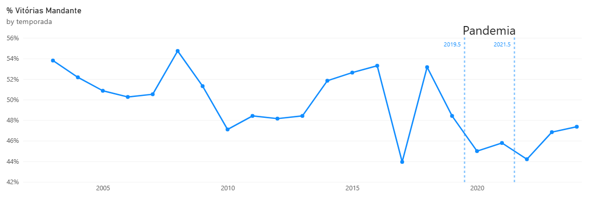
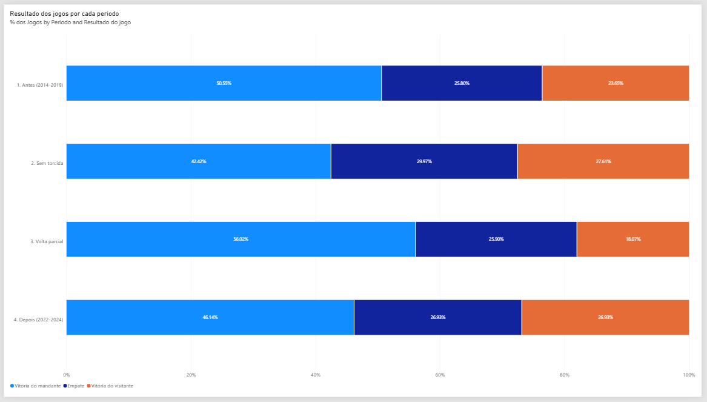
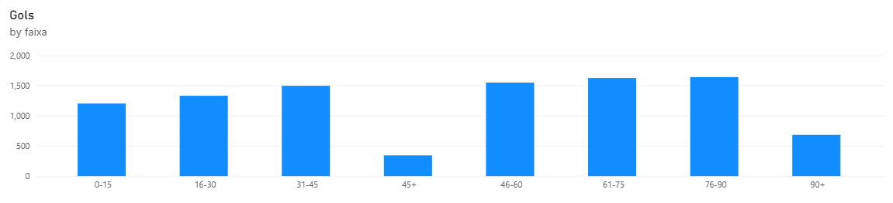
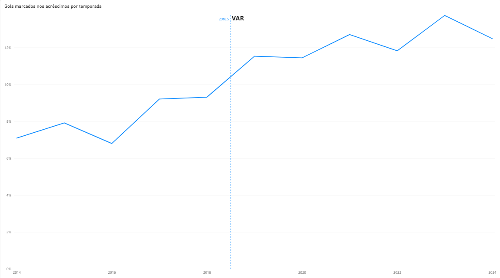
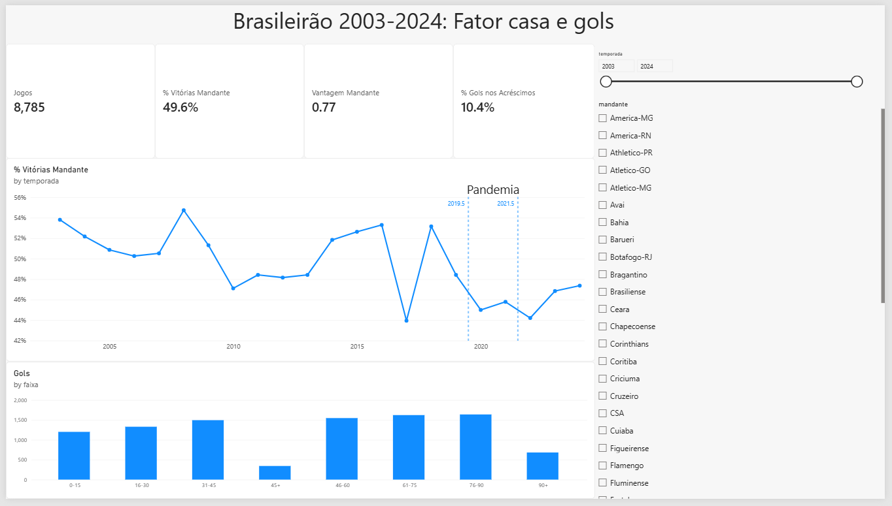

# Brasileirão em dados: fator casa e gols por minuto

Análise exploratória da Série A do Campeonato Brasileiro com Python, SQL, estatística e Power BI. São 8.785 partidas (2003 a 2024) e 9.861 gols com o minuto registrado (2014 a 2024), usados para responder duas perguntas:

1. **Jogar em casa ainda é vantagem?** E quanto a torcida pesa nisso? A pandemia, com estádios vazios, virou um experimento natural para medir.
2. **Em que momento do jogo saem os gols?** E o fim do jogo ficou mais decisivo nos últimos anos?

A primeira pergunta tem um motivo pessoal: fiz graduação em Psicologia, e a influência da torcida é, no fundo, uma questão de comportamento. Por isso os resultados são comparados com o que a pesquisa científica já encontrou (veja [O que a literatura diz](#o-que-a-literatura-diz)).

## Principais resultados

### O mandante vence cada vez menos



- Em 22 temporadas, o mandante venceu 49,6% dos jogos e o visitante, 24,0%. Na média, o time da casa faz 0,77 ponto a mais por jogo que o visitante.
- A vitória do mandante cai cerca de 3 pontos percentuais por década (regressão linear, p = 0,004).

### Sem torcida, a vantagem caiu quase pela metade



- Com portões fechados (agosto de 2020 a setembro de 2021), a vantagem do mandante caiu de 0,81 para 0,44 ponto por jogo em relação às temporadas de 2014 a 2019 (teste t de Welch, p = 0,002). A vitória do mandante foi de 50,5% para 42,4%.
- Na volta parcial do público (outubro a dezembro de 2021), o mandante venceu 56% dos jogos. São só 166 partidas, mas o resultado aponta na direção esperada.
- De 2022 a 2024, já com estádios cheios, a vantagem ficou em 0,58: abaixo do nível de antes da pandemia (p = 0,01). A torcida pesa, mas não explica toda a queda.

### Os gols aumentam conforme o jogo avança



- 55,7% dos gols saem no 2º tempo.
- Os acréscimos duram poucos minutos e mesmo assim concentram 10,4% dos gols.
- Quase 1 em cada 5 jogos (17,9%) muda de resultado depois dos 80 minutos.

### Depois do VAR, os acréscimos ficaram mais decisivos



- A fatia de gols marcados nos acréscimos foi de 7,1% em 2014 para 13,7% em 2023.
- Os jogos com resultado alterado nos acréscimos do 2º tempo passaram de 4,7% a 6,3% (2014 a 2017) para 8,7% a 10,3% (2019 a 2023).
- A mudança coincide com a chegada do VAR, usado em todos os jogos da Série A desde 2019. Os gols de pênalti também subiram: média de 75 por temporada de 2014 a 2018 e de 97 de 2019 a 2023.

## Dashboard no Power BI



O arquivo está em `dashboard/brasileirao.pbix`. Os filtros por temporada e por clube mandante mostram o fator casa de cada time.

## O que a literatura diz

Os resultados deste projeto batem com o que a pesquisa encontrou em outras ligas:

- **A torcida influencia a arbitragem.** Em um experimento, árbitros que avaliaram lances ouvindo o barulho da torcida marcaram 15,5% menos faltas contra o time da casa do que os que assistiram em silêncio (Nevill, Balmer e Williams, 2002). O barulho também funciona como pista na decisão de dar cartão amarelo (Unkelbach e Memmert, 2010).
- **Até os acréscimos são afetados.** Na Espanha e na Alemanha, árbitros deram mais acréscimos quando o mandante estava perdendo um jogo equilibrado, e menos quando ele estava ganhando (Garicano, Palacios-Huerta e Prendergast, 2005; Dohmen, 2008).
- **Sem torcida, a vantagem caiu na maior parte das ligas.** Uma revisão de 28 estudos, cobrindo 41 ligas de 30 países, concluiu que os jogos sem público reduziram a vantagem do mandante, com variação entre países (Wang e Qin, 2023). Em 4.844 jogos de 15 ligas europeias, a queda veio principalmente de um desempenho pior do time da casa, e o viés da arbitragem diminuiu sem desaparecer (McCarrick e colegas, 2021).
- **No Brasil, o mesmo padrão.** Na Série A, a vantagem de 2019 e 2020 foi menor que a de 2018 (Ribeiro e colegas, 2022), e voltou a subir nas rodadas de 2021 com público (Silva e colegas, 2022), como nos dados deste projeto.
- **A queda de longo prazo não é novidade.** A vantagem do mandante já vinha diminuindo nas grandes ligas europeias (Pollard, 2008).

Um ponto que não encontrei nos estudos sobre o Brasileirão: depois que o público voltou, de 2022 a 2024, a vantagem do mandante não retornou ao nível de antes da pandemia.

Os próprios estudos fazem um alerta que vale aqui também: a pandemia mudou outras coisas além da torcida, como o calendário mais apertado e as cinco substituições por jogo.

## Como foi feito

| Etapa | Ferramentas |
|---|---|
| Limpeza e validação | Python, Pandas |
| Consultas | SQL com DuckDB, direto sobre os DataFrames |
| Estatística | SciPy: regressão linear, teste t de Welch e intervalos de confiança |
| Visualização | Matplotlib e Power BI |

Problemas encontrados nos dados brutos e como foram tratados (detalhes no [notebook 01](notebooks/01_limpeza_dados.ipynb)):

- **Temporada x ano civil:** o Brasileirão 2020 terminou em fevereiro de 2021 por causa da pandemia. Criei a coluna `temporada` para não misturar dois campeonatos no mesmo ano.
- **Caractere invisível:** mais da metade dos nomes de arena começava com um espaço não separável (`\xa0`). Um filtro por "Maracanã" retornava zero jogos.
- **Placar x vencedor:** um jogo de 2005 tinha a coluna `vencedor` diferente do placar. Pesquisando, descobri que o resultado foi alterado pelo STJD, então usei o placar oficial.
- **Validação dos gols:** a soma dos gols de cada partida bate com o placar em 100% dos 4.179 jogos de 2014 a 2024.

## Estrutura

```
├── dashboard/
│   └── brasileirao.pbix           dashboard do Power BI
├── data/
│   ├── raw/                       dados originais
│   └── processed/                 dados limpos, gerados pelo notebook 01
├── images/                        gráficos usados neste README
├── notebooks/
│   ├── 01_limpeza_dados.ipynb
│   ├── 02_fator_casa.ipynb
│   └── 03_gols_por_minuto.ipynb
├── src/
│   ├── dados.py                   leitura e limpeza
│   └── graficos.py                estilo dos gráficos
└── requirements.txt
```

## Como rodar

Precisa de Python 3.10 ou mais recente.

```bash
git clone https://github.com/salomaochamma/brasileirao2003-2024_analise.git
cd brasileirao2003-2024_analise
python -m venv .venv
source .venv/bin/activate
pip install -r requirements.txt
jupyter notebook
```

No Windows, ative o ambiente com `.venv\Scripts\activate`.

Rode os notebooks na ordem. O 01 gera os arquivos de `data/processed`, que os outros dois usam.

## Dados

[Brasileirao_Dataset](https://github.com/adaoduque/Brasileirao_Dataset), mantido por Adão Duque, com as partidas, gols, cartões e estatísticas da Série A desde 2003.

## Próximos passos

- Testar o mecanismo apontado pela literatura: sem torcida, o árbitro deu menos cartões para o visitante?
- Incluir a temporada 2025, que na fonte está em JSON e com outro formato
- Montar o ranking de gols contra por time
- Medir o efeito da troca de técnico no desempenho dos times
- Analisar com que frequência quem abre o placar vence

## Referências

- Dohmen, T. (2008). The influence of social forces: evidence from the behavior of football referees. *Economic Inquiry*, 46(3), 411-424. https://doi.org/10.1111/j.1465-7295.2007.00112.x
- Garicano, L., Palacios-Huerta, I., & Prendergast, C. (2005). Favoritism under social pressure. *Review of Economics and Statistics*, 87(2), 208-216. https://www.nber.org/papers/w8376
- McCarrick, D., Bilalic, M., Neave, N., & Wolfson, S. (2021). Home advantage during the COVID-19 pandemic: Analyses of European football leagues. *Psychology of Sport and Exercise*, 56, 102013. https://doi.org/10.1016/j.psychsport.2021.102013
- Nevill, A. M., Balmer, N. J., & Williams, A. M. (2002). The influence of crowd noise and experience upon refereeing decisions in football. *Psychology of Sport and Exercise*, 3(4), 261-272. https://doi.org/10.1016/S1469-0292(01)00033-4
- Pollard, R. (2008). Home advantage in football: A current review of an unsolved puzzle. *The Open Sports Sciences Journal*, 1, 12-14.
- Ribeiro, L. D. C., et al. (2022). Did the absence of crowd support during the Covid-19 pandemic affect the home advantage in Brazilian elite soccer? *Journal of Human Kinetics*, 81, 251-258. https://doi.org/10.2478/hukin-2022-0047
- Silva, A. C., et al. (2022). Two years of COVID-19 pandemic: How the Brazilian Serie A championship was affected by home advantage, performance and disciplinary aspects. *International Journal of Environmental Research and Public Health*, 19(16), 10308. https://doi.org/10.3390/ijerph191610308
- Unkelbach, C., & Memmert, D. (2010). Crowd noise as a cue in referee decisions contributes to the home advantage. *Journal of Sport & Exercise Psychology*, 32(4), 483-498.
- Wang, S., & Qin, Y. (2023). The impact of crowd effects on home advantage of football matches during the COVID-19 pandemic: A systematic review. *PLoS ONE*, 18(11), e0289899. https://doi.org/10.1371/journal.pone.0289899

## Autor

Raphael Salomão Chamma · raphaelchamma53@gmail.com · [GitHub](https://github.com/salomaochamma)
